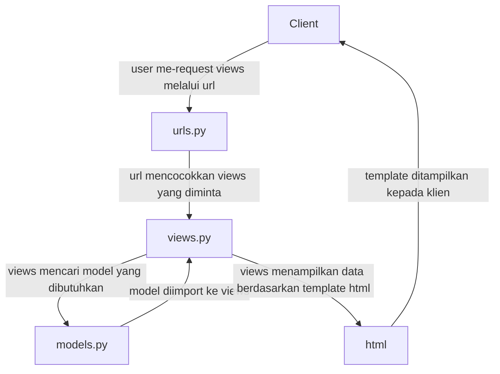

Tugas 6:
1. Jelaskan perbedaan antara asynchronous programming dengan synchronous programming. \
Jawaban: Asynchronous programming adalah ketika suatu program dapat melakukan beberapa tasks sekaligus secara paralel, sedangkan synchronous programming melakukan tasknya satu per satu saja. Kelebihan asynchronous programming adalah ia lebih cepat, namun memerlukan tingkat keahlian yang tinggi untuk mengimplementasikannya, sedangkan synchronous programming lebih lambat, namun lebih simpel dan mudah untuk digunakan dan dikembangkan. \
Sumber: https://distantjob.com/blog/synchronous-vs-asynchronous-programming/

2. Dalam penerapan JavaScript dan AJAX, terdapat penerapan paradigma event-driven programming. Jelaskan maksud dari paradigma tersebut dan sebutkan salah satu contoh penerapannya pada tugas ini. \
Jawaban: paradigma event-driven programming adalah ketika suatu program bergantung pada events yang terjadi. Suatu program tidak akan berjalan terus menerus, melainkan menunggu hingga ada event tertentu, baru ia menjalankan program sesuai yang diperintahkan. Dalam tugas ini, contohnya adalah dalam kalimat ini document.getElementById("button_add").onclick = addItem, dalam command event-driven ini, fungsi addItem akan dijalankan ketika button dengan id +button_add" ditekan. \
Sumber: https://reintech.io/blog/what-is-event-driven-programming-in-javascript

3. Jelaskan penerapan asynchronous programming pada AJAX. \
Jawaban: AJAX menerapkan asynchronous programming dengan mengirim data ke penengah di server, lalu dikirim kembali sehingga kita tidak perlu reload website untuk memperbarui data. Salah satu cara mengirim data adalah menggunakan XMLHttpRequest, tapi kita juga bisa menggunakan fetch() dengan Fetch API. \
Sumber: https://pbp-fasilkom-ui.github.io/ganjil-2024/docs/tutorial-5

4. Pada PBP kali ini, penerapan AJAX dilakukan dengan menggunakan Fetch API daripada library jQuery. Bandingkanlah kedua teknologi tersebut dan tuliskan pendapat kamu teknologi manakah yang lebih baik untuk digunakan. \
Jawaban: Fetch API menggunakan JSON atau teks, sedangkan jQuery menggunakan XML. Keduanya menggunakan AJAX, namun syntax dari jQuery lebih memusingkan daripada Fetch API, dan Fetch lebih mudah dan cepat daripada jQuery karena berbasis Promise, tidak seperti jQuery yang berbasis callback. Secara kesimpulan, Fetch memiliki lebih banyak kelebihan daripada jQuery. \
Jawaban: https://medium.com/javascript-indonesia-community/berbagai-teknik-dan-cara-melakukan-fetch-api-menggunakan-javascript-yang-harus-kamu-ketahui-5a94f361643a

5. Jelaskan bagaimana cara kamu mengimplementasikan checklist di atas secara step-by-step (bukan hanya sekadar mengikuti tutorial). \
Jawaban:
Mengubah tugas 5 yang telah dibuat sebelumnya menjadi menggunakan AJAX. \
Untuk membuat sebuah tabel dengan AJAX, saya menghapus seluruh tabel yang saya buat sebelumnya di main.html dan mengubahnya menjadi tabel berbasis bootstrap, lalu beberapa objek diberi id agar bisa menggunakan getELementbyId di dalam script, yang diletakkan di paling bawah file. Saya tidak menggunakan approach cards di Tugas 5.

AJAX GET: Ubahlah kode cards data item agar dapat mendukung AJAX GET dan lakukan pengambilan task menggunakan AJAX GET. \
Dalam skrip di main.html, saya membuat fungsi getItems() yang fetch fungsi get_items_json di views.py, dan fungsi ini akan menerima semua input yaitu name, amount, dan description, lalu ditempatkan lagi di item_table di main.html. Saya juga menambahkan link ke get_items_json tersebut di urls.py. 

AJAX POST: 

Buatlah sebuah tombol yang membuka sebuah modal dengan form untuk menambahkan item. \
Untuk ini saya membuat button Add Item by Ajax di bawah tabel item_table yang akan menutup elemen di belakangnya dan membuka form dengan data-bs-toggle="modal" data-bs-target="#exampleModal". 

Buatlah fungsi view baru untuk menambahkan item baru ke dalam basis data. \
Fungsi yang saya buat adalah add_item_ajax() di views.py yang menerima semua input name, amount, dan description lalu direturn ke refreshItems() di skrip main.html. 

Buatlah path /create-ajax/ yang mengarah ke fungsi view yang baru kamu buat. \
Saya menambah path /create-item-ajax/ di urls.py yang memanggil fungsi add_item_ajax() dari views.py 

Hubungkan form yang telah kamu buat di dalam modal kamu ke path /create-ajax/. \
Dalam skrip main.html di fungsi refreshItems saya menggunakan fetch untuk memanggil fungsi add_item_ajax() dari main.html. 

Lakukan refresh pada halaman utama secara asinkronus untuk menampilkan daftar item terbaru tanpa reload halaman utama secara keseluruhan. \
Dalam fungsi refreshItems saya menggunakan POST untuk langsung memperbarui data di form tanpa harus mereload data. 

Melakukan perintah collectstatic, perintah ini bertujuan untuk mengumpulkan file static dari setiap aplikasi kamu ke dalam suatu folder yang dapat dengan mudah disajikan pada produksi. \
Untuk ini, saya membuat STATIC_ROOT di settings.py yang mengarah ke folder 'static', lalu saya buat folder baru bernama 'static' di direktori utama inventory_list, lalu di Command Prompt saya menjalankan python manage.py collectstatic yang mengambil semua data static dari program lalu disimpan di folder tersebut. 

Tugas 5:
1. Jelaskan manfaat dari setiap element selector dan kapan waktu yang tepat untuk menggunakannya. \
Jawaban:
Element selector: digunakan ketika ingin mencakup seluruh elemen yang sama (h1, p, table, dll) \
ID selector: digunakan ketika ingin mencakup satu elemen saja, karena id bersifat unik (
 mendefinisikan suatu paragraf \
<"h1">...<"h6"> mendefinisikan header pertama hingga keenam \
<"link"> mendefinisikan suatu url link \
<"table"> mendefinisikan suatu tabel \
<"div"> mendefinisikan suatu divisi atau kelompok tertentu \
Sumber: https://www.w3schools.com/TAGS/default.asp
    
3. Jelaskan perbedaan antara margin dan padding. \
Jawaban:
Padding adalah ruang kosong antara konten dan border, sedangkan margin adalah ruang kosong antara border dan area di luar elemen tersebut. Margin bersifat transparan dan perubahan elemen tidak mempengaruhi margin, namun perubahan pada elemen biasanya mempengaruhi padding juga. Selain itu, margin bisa disetel auto margin, namun padding tidak. \
Sumber: https://www.geeksforgeeks.org/css-padding-vs-margin/ 

4. Jelaskan perbedaan antara framework CSS Tailwind dan Bootstrap. \
Jawaban: Framework Tailwind mengutamakan fleksibilitas dan utilitas agar penggunanya dapat merancang desain kreatif mereka sendiri, sedangkan Bootstrap mengutamakan konsistensi dan efisiensi dengan menyediakan komponen yang sudah siap pakai. Selain itu, Tailwind memerlukan ukuran file yang kecil berisi dengan utilitas tertentu saja, sedangkan Bootstrap memerlukan ukuran file yang lebih besar. \
Sumber: https://www.tutorialspoint.com/tailwind-css-vs-bootstrap

5. Kapan sebaiknya kita menggunakan Bootstrap daripada Tailwind, dan sebaliknya? \
Jawaban: Umumnya Tailwind digunakan ketika pengguna ingin membuat desain mereka sendiri, sedangkan Bootstrap digunakan ketika pengguna ingin membuat desain yang sudah ada. \
Sumber: https://www.tutorialspoint.com/tailwind-css-vs-bootstrap

6. Jelaskan bagaimana cara kamu mengimplementasikan checklist di atas secara step-by-step (bukan hanya sekadar mengikuti tutorial). \
Jawaban: Untuk mengkustomisasi halaman login, register, dan tambah inventori, saya membuat sebuah class .full-screen-box di base.html yang mencakup seluruh file html di main/templates yang extend dari file base.html tersebut. Class ini memberikan background yang sama dan menempatkan seluruh elemen di tengah-tengah layar untuk seluruh file. Selanjutnya saya juga menambahkan selector body yang merubah warna teks menjadi warna yang diinginkan. \
Untuk mengkustomisasi halaman daftar inventori, saya memberi border pada tabel daftar item dan sedikit mengubah teks akun dan kelas. Selain itu, saya juga menambah tombol edit dan delete item dengan cara menambah fungsi edit_itemnya dan delete_itemnya di file views.py dan menambah url link yang sesuai di urls.py. Untuk edit_itemnya karena memerlukan tampilan tambahan, maka dibuat file baru yaitu file edit_itemnya.html di folders main/templates.

Tugas 4:

1. Apa itu Django UserCreationForm, dan jelaskan apa kelebihan dan kekurangannya?\
Jawaban: UserCreationForm dalam Django digunakan untuk membuat akun baru dalam web development Django. Ketika ada function ini, maka user bisa membuat akun dengan mendaftarkan nama akun mereka, password akun, lalu konfirmasi password. Beberapa kelebihannya adalah menerima karakter ASCII dan Unicode, bisa diasosiasikan dengan email (namun tidak wajib), dan lain-lain. Contoh kekurangannya adalah nama user tidak case-insensitive, dan akun tanpa password tidak bisa di reset passwordnya. \
Sumber: https://simpleisbetterthancomplex.com/article/2021/07/08/what-you-should-know-about-the-django-user-model.html

3. Apa perbedaan antara autentikasi dan otorisasi dalam konteks Django, dan mengapa keduanya penting?\
Jawaban: Autentikasi adalah proses yang memverifikasi akun user, sedangkan otorisasi adalah proses yang menentukan apa saja yang user itu boleh lakukan. Dalam Django, autentikasi mencakup kedua proses tersebut. Autentikasi dan otorisasi adalah proses-proses yang penting agar server bisa menjaga keamanan website dari user yang tidak diautentikasi, serta membatasi hal-hal penting yang mempengaruhi server dari user-user biasa.\
Sumber: https://docs.djangoproject.com/en/4.2/topics/auth/#:~:text=Overview,to%20refer%20to%20both%20tasks. \
https://tomorrowsoffice.com/identity-and-access-management/#:~:text=Authentication%20is%20important%20because%20it,network%2Dbased%20applications%20or%20services.

5. Apa itu cookies dalam konteks aplikasi web, dan bagaimana Django menggunakan cookies untuk mengelola data sesi pengguna?\
Jawaban: Cookies adalah file kecil berbentuk teks yang berisi dengan data dan informasi user yang disimpan dalam browser. Cookies berfungsi untuk meningkatkan personalisasi akun user dengan menyimpan data relevan user dan menampilkannya lagi ketika user mengakses browser yang sama. Dalam Django, kita bisa menambah cookies dengan mengimplementasikan function set_cookie('cookie_name', 'cookie-value') dan get('cookie_name'), kita juga bisa memberi waktu berakhirnya cookies tersebut dengan function set_cookie(key, value='', max_age=None, expires=None) selama None diubah dengan waktu yang diinginkan.
Sumber: https://appmaster.io/blog/role-of-cookies-in-web-development \
https://www.programink.com/django-tutorial/django-cookies.html#:~:text=A%20cookie%20is%20a%20small,gets%20added%20to%20the%20request. \

6. Apakah penggunaan cookies aman secara default dalam pengembangan web, atau apakah ada risiko potensial yang harus diwaspadai?\
Jawaban: Secara umum, cookies seharusnya aman dalam pengembangan web, namun terkadang masih ada risiko keamanan jika menggunakan cookies. Sebagai contoh, jika ada informasi yang sensitif dalam akun user, maka seorang hacker bisa mencuri data tersebut dan menyalahgunakannya untuk hal lain. Contoh lain dapat terjadi sebaliknya, di mana seorang hacker dapat menyusupkan virus dan malware ke komputer kita dengan cara menyamarkannya dalam bentuk cookies. Namun, hal-hal tersebut harusnya tidak terjadi selama keamanan website masih tinggi dan tidak ada celah-celah yang bisa dieksploitasi.
Sumber: https://appmaster.io/blog/role-of-cookies-in-web-development \
https://www.kaspersky.com/resource-center/definitions/cookies \

7. Jelaskan bagaimana cara kamu mengimplementasikan checklist di atas secara step-by-step (bukan hanya sekadar mengikuti tutorial).\
Jawaban:

Untuk mengimplementasikan fungsi registrasi, login, dan logout user, maka pertama saya megimport UserCreationForm redirect, dan messages di views.py, menambah fungsi register, dan membuat register.html di main/templates berisi format html register tersebut. Setelah itu untuk login dan logout, kita mengimport authenticate, login, dan logout serta menambah fungsi masing-masing di views.py, serta membuat login.html sebagai tempat user membuat akun dan menambah tombol logout dalam main.html. Setelah itu semua, tidak lupa kita menambah path masing-masing fungsi dalam urls.py. 

Untuk membuat akun pengguna dan menambah dummy datanya, sebelumnya kita perlu membuat sebuah akun di website kita dengan cara register, lalu ketika sudah login kita bisa menambah barang-barang yang diinginkan serta nama, jumlah, dan deskripsi masing-masing dengan tombol add new item. 

Untuk menghubungkan model Item dengan User, dalam models.py kita perlu mengimport User serta menambah object user dalam class Item, lalu dalam views.py kita juga perlu menambah fungsi create_product yang akan menambah barang-barang baru kepada akun user yang sedang login. 

Untuk menampilkan detail informasi pengguna yang sedang logged in seperti username dan menerapkan cookies seperti last login pada halaman utama aplikasi, pertama kita perlu mengimport datetime dalam views.py, lalu menambah request cookie datetime now untuk fungsi login_user, dan dalam show_main kita menambah objek last_login untuk mengakses cookie tersebut dan menampilkan last login dalam website kita. Untuk menampilkan username kita, ketika sedang mengimplementasi objek User, kita bisa membuka views.py dan mengubah objek name menjadi 'name': request.user.username agar data yang ditampilkan adalah username akun yang sedang login.

Tugas 3:

1. Apa perbedaan antara form POST dan form GET dalam Django?\
Jawaban: form POST digunakan untuk menerima seluruh request yang dapat mengubah server, sedangkan form GET mengubah data yang diterimanya dalam bentuk URL. Perbedaan utamanya adalah form POST digunakan untuk data yang bisa diproses dan dimodifikasi nantinya, sedangkan form GET hanya digunakan untuk mengambil data yang tidak mempengaruhi server.\
Sumber: 
https://www.baeldung.com/cs/http-get-vs-post#:~:text=GET%20requests%20are%20intended%20to,may%20modify%20the%20server's%20state. 

2. Apa perbedaan utama antara XML, JSON, dan HTML dalam konteks pengiriman data? \
Jawaban: Secara umum, HTML digunakan untuk mengatur bagaimana suatu data ditampilkan, sedangkan XML dan JSON digunakan untuk menyimpan atau mengirim data. Perbedaan antara XML dan JSON sendiri adalah formatnya, di mana JSON menggunakan {}(curly brackets) dan lebih mudah dibaca, sedangkan XML menggunakan start dan end tag seperti HTML, namun lebih aman daripada JSON.\
Sumber: \
https://stackoverflow.com/questions/55893598/are-xml-and-json-used-to-communicate-information-between-a-client-and-a-server \
https://www.deltaxml.com/blog/xml/whats-the-relationship-between-xml-json-html-and-the-internet/#:~:text=The%20differences%20between%20XML%2C%20JSON,how%20that%20data%20is%20displayed. \

3. Mengapa JSON sering digunakan dalam pertukaran data antara aplikasi web modern?
Jawaban: Karena JSON ukurannya lebih kecil, sehingga lebih cepat saat dikirim. Selain itu, format JSON lebih mudah dibaca dibandingkan XML dan kompatibel dengan native data type, JavaScript, serta web technology lainnya.\
Sumber: https://www.linkedin.com/advice/0/what-advantages-disadvantages-using-json-vs-xml#:~:text=JSON%20is%20often%20the%20preferred,and%20efficiency%20of%20data%20processing.

4. Jelaskan bagaimana cara kamu mengimplementasikan checklist di atas secara step-by-step (bukan hanya sekadar mengikuti tutorial). \

Checklist Tugas

-Membuat input form untuk menambahkan objek model pada app sebelumnya. \
Jawaban: Pertama saya membuat file "forms.py" di folder main lalu mengisi class ItemForm sebagai kerangka Form. Lalu saya ke file "views.py" dan membuat function create_item untuk menerima request data dari user. Setelah itu, saya mengubah function show_main yang sudah ada sebelumnya untuk menerima data seluruh object Item yang telah diterima, dan tidak lupa untuk menambah import Item dan ItemForm dari file forms dan models di main. Selanjutnya saya ke "urls.py" untuk membuat path url untuk function create_item. Lalu saya membuat file create_item.html di main/templates untuk menambahkan Item ke database. Terakhir saya melengkapi main.html untuk menampilkan Item yang sudah ditambah oleh user. 

-Tambahkan 5 fungsi views untuk melihat objek yang sudah ditambahkan dalam format HTML, XML, JSON, XML by ID, dan JSON by ID. \
Jawaban: Untuk format HTML sudah tertera dalam step sebelumnya, sedangkan keempat fungsi sisanya sangat mirip satu sama lain. Sebagai contoh, untuk menampilkan dalam format xml, pertama dibutuhkan fungsi show_xml untuk menyimpan query pada Item laludikembalikan dalam bentuk httpresponse. Lalu, dalam file "urls.py" juga diberi path xml/ agar bisa mengakses data tersebut dalam format xml. Itu adalah contoh untuk format xml, dan format json sama persis dengan cara tersebut, hanya dengan nama yang berbeda. Untuk kedua format lainnya cukup mirip, namun untuk function show_xml atau json_by_id nya, ia menerima parameter id sehingga hanya khusus data satu id tersebut yang ditampilkan kepada user. 

-Membuat routing URL untuk masing-masing views yang telah ditambahkan pada poin 2. \

Jawaban: Untuk setiap format, di barisan paling atas dari file "urls.py", file mengimport setiap fungsi yang mengambil kelima format itu yaitu show_main, create_product, show_xml, show_json, show_xml_by_id, dan show_json_by_id. Selain itu, dalam urlspattern saya juga menambah path url untuk setiap format tersebut agar bisa diakses oleh user.

5. Mengakses kelima URL di poin 2 menggunakan Postman, membuat screenshot dari hasil akses URL pada Postman, dan menambahkannya ke dalam README.md. \

Tugas 2:
Tautan Adaptable.io: https://inventory-sandria-rania.adaptable.app/ 

1. Jelaskan bagaimana cara kamu mengimplementasikan checklist di atas secara step-by-step (bukan hanya sekadar mengikuti tutorial).

Checklist Tugas

-Membuat sebuah proyek Django baru.\
Jawaban: Membuat repository baru di Github bernama "inventory_app" untuk proyek baru, lalu menulis "git clone" di Command Terminal. Setelah muncul di direktori lokal, saya membuat file "requirements.txt" dan menambah beberapa instalasi untuk deployment aplikasi, salah satunya adalah Django.

-Membuat aplikasi dengan nama main pada proyek tersebut.\
Jawaban: Setelah memastikan Command Terminal ada di dalam direktori utama "inventory_app", tulis django-admin "python manage.py startapp main" untuk membuat direktori baru bernama main dengan file-file aplikasi yang diberikan secara default oleh Django.

-Melakukan routing pada proyek agar dapat menjalankan aplikasi main.\
Jawaban: Di dalam file "settings.py" di dalam direktori proyek "inventory-app", scroll sampai menemukan "INSTALLED APPS" lalu menambah 'main' di dalam list tersebut agar main bisa dijalankan.

-Membuat model pada aplikasi main dengan nama Item dan memiliki atribut wajib sebagai berikut.\
name sebagai nama item dengan tipe CharField.\
amount sebagai jumlah item dengan tipe IntegerField.\
description sebagai deskripsi item dengan tipe TextField.\
Jawaban: Dalam file "models.py" saya membuat sebuah class Item dan menambah ketiga item yaitu name, amount, dan description dengan tipe-tipe sesuai kriteria tugas.

-Membuat sebuah fungsi pada views.py untuk dikembalikan ke dalam sebuah template HTML yang menampilkan nama aplikasi serta nama dan kelas kamu.\
Jawaban: Dalam files "views.py" menambah function show_main yang me-render "main.html". File "main.html" diisi dengan judul aplikasi, nama, kelas, dan NPM dengan format masing-masing. Khususnya untuk nama, kelas, dan NPM ditampilkan dengan variabel name, class, dan npm agar bisa disesuaikan dengan 'context' yang ada di fungsi show_main dalam file "views.py".

-Membuat sebuah routing pada urls.py aplikasi main untuk memetakan fungsi yang telah dibuat pada views.py.\
Jawaban: Meng-import "show_main" dari main.views, lalu membuat list urlpatterns yang terhubung dengan fungsi show_mains dari file "views.py" sebelumnya.

-Melakukan deployment ke Adaptable terhadap aplikasi yang sudah dibuat sehingga nantinya dapat diakses oleh teman-temanmu melalui Internet.\
Jawaban: Membuka adaptable.io lalu memilih "create new app", "Connect an Existing Repository",  repo "inventory_app", "Python App Template", dan "PostgreSQL". Setelah itu saya menyesuaikan versi python dan menambah Start Command yaitu "python manage.py migrate && gunicorn shopping_list.wsgi". Lalu saya mengisi nama aplikasi, mencentang "HTTP Listener on PORT", dan mendeploy aplikasi.

-Membuat sebuah README.md yang berisi tautan menuju aplikasi Adaptable yang sudah di-deploy, serta jawaban dari beberapa pertanyaan berikut.
Jawaban: Untuk ini saya membuka file README.md di VSCode lalu saya mengeditnya di aplikasi tersebut.

2. Buatlah bagan yang berisi request client ke web aplikasi berbasis Django beserta responnya dan jelaskan pada bagan tersebut kaitan antara urls.py, views.py, models.py, dan berkas html.

Sumber: \
https://github.com/mermaid-js/mermaid \
https://www.w3schools.com/django/django_intro.php#:~:text=How%20does%20Django%20Work%3F,the%20request%20from%20the%20user.

3. Jelaskan mengapa kita menggunakan virtual environment? Apakah kita tetap dapat membuat aplikasi web berbasis Django tanpa menggunakan virtual environment?\
Jawaban: Virtual environment dibutuhkan ketika sebuah proyek membutuhkan beberapa versi Python atau third-party packages atau dependencies sekaligus, sebagai contoh adalah proyek-pryek Django. Untuk mencegah setiap proyek saling mempengengaruhi satu sama lain, maka dibutuhkan virtual environment ketika dijalankan. Namun, virtual environment tidak wajib. Kita tetap bisa membuat sebuah proyek aplikasi Django tanpa virtual environment, namun resikonya adalah setiap proyek akan terikat dengan module/package yang sama, meskipun setiap proyek mungkin membutuhkan dependency yang berbeda-beda. \
Sumber:
https://www.quora.com/What-is-the-need-of-using-virtual-environment-in-python-Django-projects \
https://stackoverflow.com/questions/44392159/should-i-always-use-virtualenvs-in-django

5. Jelaskan apakah itu MVC, MVT, MVVM dan perbedaan dari ketiganya.\
Jawaban:
Ketiga contoh yang disebut adalah konsep-konsep web application yang digunakan dalam dunia pengembangan web. Persamaan ketiga konsep tersebut adalah semuanya memiliki Model dan View, walaupun fungsi kedua hal tersebut mungkin bisa memiliki beberapa variasi tergantung konsep yang digunakan, namun secara umum Model adalah tempat penyimpanan data, sedangkan View adalah layer yang bertanggungjawab terhadap apa yang ditampilkan terhadap user. Perbedaan ketiga konsep terdapat pada komponen ketiga, yaitu bagaimana hubungan Model, View, dan komponen ketiga masing-masing konsep.\
MVC (Model-View-Controller) adalah konsep web application yang bergantung terhadap Controller sebagai jembatan yang menghubungi Model dan View. Dalam konsep ini, Controller bertanggung jawab meng-update Model dan View setiap ada perubahan. \
MVT (Model-View-Template) adalah konsep web application di mana tampilan dalam layar user tergantung terhadap Template, yang umumnya dalam bentuk HTML. Hal ini berbeda dengan konsep MVC, di mana tampilan layar tergantung terhadap Views. Selain itu, karena tidak adanya Controller dalam MVT, maka peran tersebut dilakukan oleh framework web itu sendiri. \
MVVM (Model-View-ViewModel) adalah konsep web application di mana ViewModel adalah layer yang bertanggung jawab untuk menampilkan data kepada user, sedangkan View digunakan sebagai tempat menyimpan bagaimana cara menampilkan data serta respons user yang akan mempengaruhi tampilan. Konsep MVVM ini adalah yang paling berbeda dengan MVC dan MVT, yang bisa dilihat dari strukturnya lebih simpel daripada MVVM. \
Sumber:
https://www.geeksforgeeks.org/difference-between-mvc-mvp-and-mvvm-architecture-pattern-in-android/ \
https://www.geeksforgeeks.org/difference-between-mvc-and-mvt-design-patterns/
