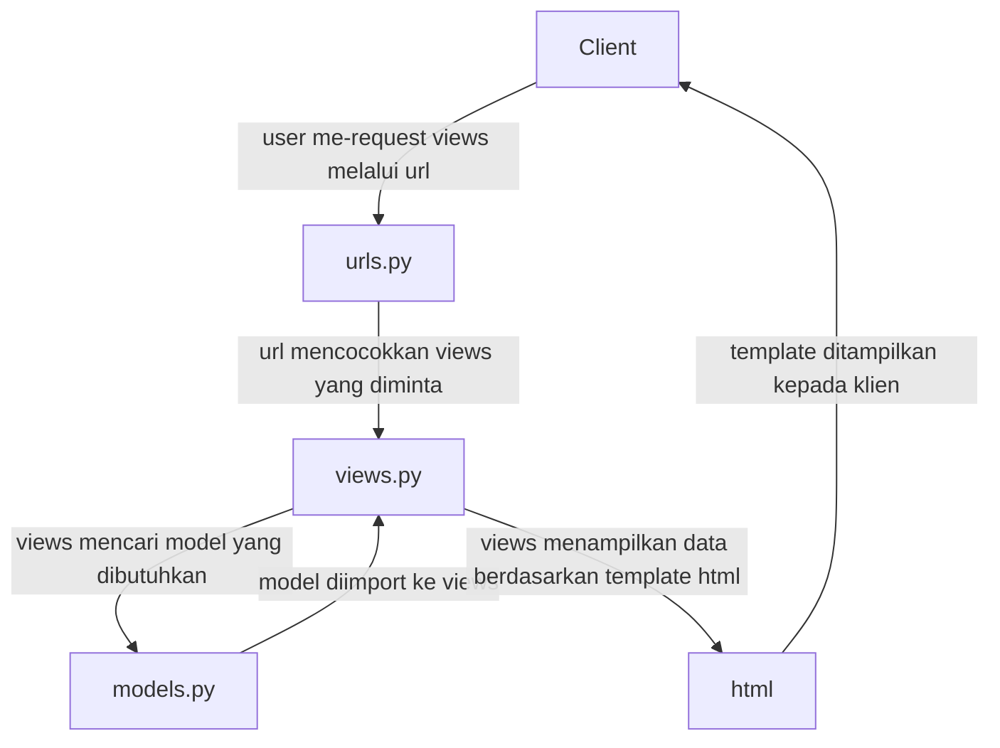

Tugas 3:

1. Apa perbedaan antara form POST dan form GET dalam Django?\
Jawaban: form POST digunakan untuk menerima seluruh request yang dapat mengubah server, sedangkan form GET mengubah data yang diterimanya dalam bentuk URL. Perbedaan utamanya adalah form POST digunakan untuk data yang bisa diproses dan dimodifikasi nantinya, sedangkan form GET hanya digunakan untuk mengambil data yang tidak mempengaruhi server.\
Sumber: 
https://www.baeldung.com/cs/http-get-vs-post#:~:text=GET%20requests%20are%20intended%20to,may%20modify%20the%20server's%20state. 

2. Apa perbedaan utama antara XML, JSON, dan HTML dalam konteks pengiriman data? \
Jawaban: Secara umum, HTML digunakan untuk mengatur bagaimana suatu data ditampilkan, sedangkan XML dan JSON digunakan untuk menyimpan atau mengirim data. Perbedaan antara XML dan JSON sendiri adalah formatnya, di mana JSON menggunakan {}(curly brackets) dan lebih mudah dibaca, sedangkan XML menggunakan start dan end tag seperti HTML, namun lebih aman daripada JSON.\
Sumber: \
https://stackoverflow.com/questions/55893598/are-xml-and-json-used-to-communicate-information-between-a-client-and-a-server \
https://www.deltaxml.com/blog/xml/whats-the-relationship-between-xml-json-html-and-the-internet/#:~:text=The%20differences%20between%20XML%2C%20JSON,how%20that%20data%20is%20displayed. \

3. Mengapa JSON sering digunakan dalam pertukaran data antara aplikasi web modern?
Jawaban: Karena JSON ukurannya lebih kecil, sehingga lebih cepat saat dikirim. Selain itu, format JSON lebih mudah dibaca dibandingkan XML dan kompatibel dengan native data type, JavaScript, serta web technology lainnya.\
Sumber: https://www.linkedin.com/advice/0/what-advantages-disadvantages-using-json-vs-xml#:~:text=JSON%20is%20often%20the%20preferred,and%20efficiency%20of%20data%20processing.

4. Jelaskan bagaimana cara kamu mengimplementasikan checklist di atas secara step-by-step (bukan hanya sekadar mengikuti tutorial). \

Checklist Tugas

-Membuat input form untuk menambahkan objek model pada app sebelumnya. \
Jawaban: Pertama saya membuat file "forms.py" di folder main lalu mengisi class ItemForm sebagai kerangka Form. Lalu saya ke file "views.py" dan membuat function create_item untuk menerima request data dari user. Setelah itu, saya mengubah function show_main yang sudah ada sebelumnya untuk menerima data seluruh object Item yang telah diterima, dan tidak lupa untuk menambah import Item dan ItemForm dari file forms dan models di main. Selanjutnya saya ke "urls.py" untuk membuat path url untuk function create_item. Lalu saya membuat file create_item.html di main/templates untuk menambahkan Item ke database. Terakhir saya melengkapi main.html untuk menampilkan Item yang sudah ditambah oleh user. 

-Tambahkan 5 fungsi views untuk melihat objek yang sudah ditambahkan dalam format HTML, XML, JSON, XML by ID, dan JSON by ID. \
Jawaban: Untuk format HTML sudah tertera dalam step sebelumnya, sedangkan keempat fungsi sisanya sangat mirip satu sama lain. Sebagai contoh, untuk menampilkan dalam format xml, pertama dibutuhkan fungsi show_xml untuk menyimpan query pada Item laludikembalikan dalam bentuk httpresponse. Lalu, dalam file "urls.py" juga diberi path xml/ agar bisa mengakses data tersebut dalam format xml. Itu adalah contoh untuk format xml, dan format json sama persis dengan cara tersebut, hanya dengan nama yang berbeda. Untuk kedua format lainnya cukup mirip, namun untuk function show_xml atau json_by_id nya, ia menerima parameter id sehingga hanya khusus data satu id tersebut yang ditampilkan kepada user. 

-Membuat routing URL untuk masing-masing views yang telah ditambahkan pada poin 2. \

Jawaban: Untuk setiap format, di barisan paling atas dari file "urls.py", file mengimport setiap fungsi yang mengambil kelima format itu yaitu show_main, create_product, show_xml, show_json, show_xml_by_id, dan show_json_by_id. Selain itu, dalam urlspattern saya juga menambah path url untuk setiap format tersebut agar bisa diakses oleh user.

5. Mengakses kelima URL di poin 2 menggunakan Postman, membuat screenshot dari hasil akses URL pada Postman, dan menambahkannya ke dalam README.md. \

Tugas 2:
Tautan Adaptable.io: https://inventory-sandria-rania.adaptable.app/ 

1. Jelaskan bagaimana cara kamu mengimplementasikan checklist di atas secara step-by-step (bukan hanya sekadar mengikuti tutorial).

Checklist Tugas

-Membuat sebuah proyek Django baru.\
Jawaban: Membuat repository baru di Github bernama "inventory_app" untuk proyek baru, lalu menulis "git clone" di Command Terminal. Setelah muncul di direktori lokal, saya membuat file "requirements.txt" dan menambah beberapa instalasi untuk deployment aplikasi, salah satunya adalah Django.

-Membuat aplikasi dengan nama main pada proyek tersebut.\
Jawaban: Setelah memastikan Command Terminal ada di dalam direktori utama "inventory_app", tulis django-admin "python manage.py startapp main" untuk membuat direktori baru bernama main dengan file-file aplikasi yang diberikan secara default oleh Django.

-Melakukan routing pada proyek agar dapat menjalankan aplikasi main.\
Jawaban: Di dalam file "settings.py" di dalam direktori proyek "inventory-app", scroll sampai menemukan "INSTALLED APPS" lalu menambah 'main' di dalam list tersebut agar main bisa dijalankan.

-Membuat model pada aplikasi main dengan nama Item dan memiliki atribut wajib sebagai berikut.\
name sebagai nama item dengan tipe CharField.\
amount sebagai jumlah item dengan tipe IntegerField.\
description sebagai deskripsi item dengan tipe TextField.\
Jawaban: Dalam file "models.py" saya membuat sebuah class Item dan menambah ketiga item yaitu name, amount, dan description dengan tipe-tipe sesuai kriteria tugas.

-Membuat sebuah fungsi pada views.py untuk dikembalikan ke dalam sebuah template HTML yang menampilkan nama aplikasi serta nama dan kelas kamu.\
Jawaban: Dalam files "views.py" menambah function show_main yang me-render "main.html". File "main.html" diisi dengan judul aplikasi, nama, kelas, dan NPM dengan format masing-masing. Khususnya untuk nama, kelas, dan NPM ditampilkan dengan variabel name, class, dan npm agar bisa disesuaikan dengan 'context' yang ada di fungsi show_main dalam file "views.py".

-Membuat sebuah routing pada urls.py aplikasi main untuk memetakan fungsi yang telah dibuat pada views.py.\
Jawaban: Meng-import "show_main" dari main.views, lalu membuat list urlpatterns yang terhubung dengan fungsi show_mains dari file "views.py" sebelumnya.

-Melakukan deployment ke Adaptable terhadap aplikasi yang sudah dibuat sehingga nantinya dapat diakses oleh teman-temanmu melalui Internet.\
Jawaban: Membuka adaptable.io lalu memilih "create new app", "Connect an Existing Repository",  repo "inventory_app", "Python App Template", dan "PostgreSQL". Setelah itu saya menyesuaikan versi python dan menambah Start Command yaitu "python manage.py migrate && gunicorn shopping_list.wsgi". Lalu saya mengisi nama aplikasi, mencentang "HTTP Listener on PORT", dan mendeploy aplikasi.

-Membuat sebuah README.md yang berisi tautan menuju aplikasi Adaptable yang sudah di-deploy, serta jawaban dari beberapa pertanyaan berikut.
Jawaban: Untuk ini saya membuka file README.md di VSCode lalu saya mengeditnya di aplikasi tersebut.

2. Buatlah bagan yang berisi request client ke web aplikasi berbasis Django beserta responnya dan jelaskan pada bagan tersebut kaitan antara urls.py, views.py, models.py, dan berkas html.

Sumber: \
https://github.com/mermaid-js/mermaid \
https://www.w3schools.com/django/django_intro.php#:~:text=How%20does%20Django%20Work%3F,the%20request%20from%20the%20user.

3. Jelaskan mengapa kita menggunakan virtual environment? Apakah kita tetap dapat membuat aplikasi web berbasis Django tanpa menggunakan virtual environment?\
Jawaban: Virtual environment dibutuhkan ketika sebuah proyek membutuhkan beberapa versi Python atau third-party packages atau dependencies sekaligus, sebagai contoh adalah proyek-pryek Django. Untuk mencegah setiap proyek saling mempengengaruhi satu sama lain, maka dibutuhkan virtual environment ketika dijalankan. Namun, virtual environment tidak wajib. Kita tetap bisa membuat sebuah proyek aplikasi Django tanpa virtual environment, namun resikonya adalah setiap proyek akan terikat dengan module/package yang sama, meskipun setiap proyek mungkin membutuhkan dependency yang berbeda-beda. \
Sumber:
https://www.quora.com/What-is-the-need-of-using-virtual-environment-in-python-Django-projects \
https://stackoverflow.com/questions/44392159/should-i-always-use-virtualenvs-in-django

5. Jelaskan apakah itu MVC, MVT, MVVM dan perbedaan dari ketiganya.\
Jawaban:
Ketiga contoh yang disebut adalah konsep-konsep web application yang digunakan dalam dunia pengembangan web. Persamaan ketiga konsep tersebut adalah semuanya memiliki Model dan View, walaupun fungsi kedua hal tersebut mungkin bisa memiliki beberapa variasi tergantung konsep yang digunakan, namun secara umum Model adalah tempat penyimpanan data, sedangkan View adalah layer yang bertanggungjawab terhadap apa yang ditampilkan terhadap user. Perbedaan ketiga konsep terdapat pada komponen ketiga, yaitu bagaimana hubungan Model, View, dan komponen ketiga masing-masing konsep.\
MVC (Model-View-Controller) adalah konsep web application yang bergantung terhadap Controller sebagai jembatan yang menghubungi Model dan View. Dalam konsep ini, Controller bertanggung jawab meng-update Model dan View setiap ada perubahan. \
MVT (Model-View-Template) adalah konsep web application di mana tampilan dalam layar user tergantung terhadap Template, yang umumnya dalam bentuk HTML. Hal ini berbeda dengan konsep MVC, di mana tampilan layar tergantung terhadap Views. Selain itu, karena tidak adanya Controller dalam MVT, maka peran tersebut dilakukan oleh framework web itu sendiri. \
MVVM (Model-View-ViewModel) adalah konsep web application di mana ViewModel adalah layer yang bertanggung jawab untuk menampilkan data kepada user, sedangkan View digunakan sebagai tempat menyimpan bagaimana cara menampilkan data serta respons user yang akan mempengaruhi tampilan. Konsep MVVM ini adalah yang paling berbeda dengan MVC dan MVT, yang bisa dilihat dari strukturnya lebih simpel daripada MVVM. \
Sumber:
https://www.geeksforgeeks.org/difference-between-mvc-mvp-and-mvvm-architecture-pattern-in-android/ \
https://www.geeksforgeeks.org/difference-between-mvc-and-mvt-design-patterns/
